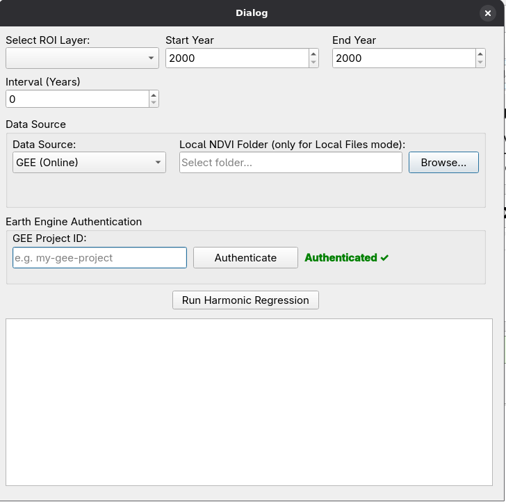

# EcoLand-OS (VSSI Harmonic Regression) QGIS Plugin

**EcoLand-OS** is a QGIS plugin designed to compute the Vegetation Seasonal Stability Index (VSSI) using harmonic regression. Healthy forests exhibit stable seasonal vegetation cycles, while stressed ecosystems show abnormal intra-annual variability. This tool empowers researchers, environmentalists, and geospatial analysts to monitor these cycles and identify ecosystem stress.

## Plugin Interface

## Key Features
* **Harmonic Regression Analysis**: Calculates the Vegetation Seasonal Stability Index (VSSI) to quantify the stability of seasonal vegetation cycles.
  
  **VSSI Calculation Formula:**
  $$ VSSI = \text{Baseline NDVI} \times (1 - \text{RMSE}) \times \left(1 - \frac{A_3}{A_1}\right) $$
  Where:
  * **Baseline NDVI** is the overall mean structural NDVI ($b_0$).
  * **RMSE** is the Root Mean Square Error representing the degree of instability.
  * **$A_1$** is the Amplitude of the Annual vegetation cycle.
  * **$A_3$** is the Amplitude of the Triannual vegetation cycle (noise/disruptions).

* **Flexible Data Sources**: 
  * **Google Earth Engine (GEE)**: Automatically fetches MODIS time series data online.
  * **Local Files**: Process local NDVI GeoTIFF stacks from a selected directory.
* **Earth Engine Integration**: Built-in Earth Engine authentication for direct access to GEE catalogs.
* **Customizable Parameters**: Define Region of Interest (ROI) layers, specific Start/End Years, and Interval settings.

## Installation

### Prerequisites
* QGIS 3.0 or higher.
* The plugin requires the `earthengine-api` Python package to be installed in your QGIS Python environment if you plan to use the GEE online feature.

### Manual Installation
1. Download or clone this repository: `git clone https://github.com/Visheshs3/VSSI_QGIS_PLUGIN.git`
2. Copy the `vssi_harmonic_regression` folder into your QGIS plugins directory:
   * **Linux**: `~/.local/share/QGIS/QGIS3/profiles/default/python/plugins/`
   * **Windows**: `C:\Users\<YourUser>\AppData\Roaming\QGIS\QGIS3\profiles\default\python\plugins\`
   * **macOS**: `~/Library/Application Support/QGIS/QGIS3/profiles/default/python/plugins/`
3. Open QGIS, go to **Plugins > Manage and Install Plugins**, and enable **EcoLand-OS**.

## Usage
1. Open the plugin via the QGIS toolbar or the Plugins menu.
2. **Select ROI Layer**: Choose a loaded polygon vector layer representing your Area of Interest.
3. **Set Timeframe**: Define the **Start Year**, **End Year**, and **Interval (Years)**.
4. **Choose Data Source**:
   * **GEE (Online)**: Enter your Google Earth Engine Project ID and click **Authenticate**.
   * **Local Files**: Browse and select a Local NDVI Folder.
5. Click **Run Harmonic Regression** to begin the processing. The output will be loaded into the QGIS map canvas upon completion.

## Issues and Feedback
If you encounter any bugs, issues, or have feature requests, please report them on the [Issue Tracker](https://github.com/Visheshs3/VSSI_QGIS_PLUGIN/issues).

## License
This project is licensed under the terms described in the `LICENSE` file.
